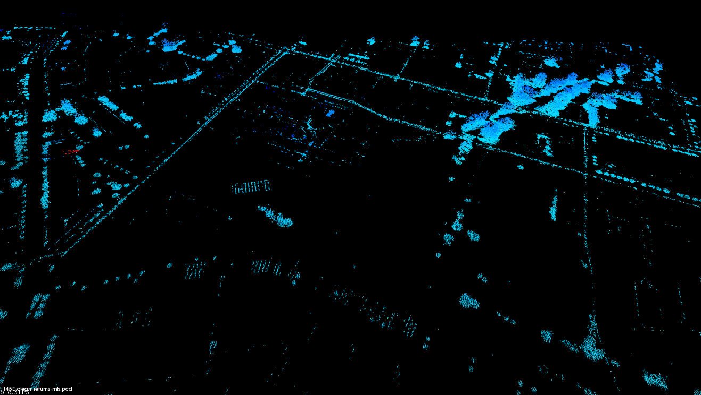

# Lidar Processing and 3D Mesh Generation

This project is the workflow I use to create three-dimensional building and terrain models from LIDAR `.las` files. The workflow relies on a number of tools and libraries including libLAS and CGAL. 



## License

Please review the licenses of the included libraries.

## Prequisites and Dependencies

The three main components of our workflow - libLAS, CGAL, and PCL - together have a large number of dependencies. The following section will provide instructions on how to compile from source those dependencies and link them if necessary.

This guide was tested and developed on Ubuntu 13.04 64-bit. Any feedback on other *nix distributions is gladly welcomed.

The following table lists the current version of all the required and optional components used in the project:

| Component     | Version       |
| ------------- |:-------------:|
| boost         | 1.53.0        |
| CMake      	| 2.8.11.1      |

### Boost C++ Libraries

The [boost C++ libraries](http://www.boost.org/) provide optimized and best-practice C++ source libraries that are used by a few of the components. Please [download](http://www.boost.org/users/download/) the latest stable release and change the following commands accordingly if necessary.

```bash
# Install Boost libraries
sudo tar -xvzf boost_1_53_0.tar.gz -C /opt
cd /opt/boost_1_53_0/
sudo ./bootstrap.sh
sudo ./b2
```

### CMake

[CMake](http://www.cmake.org/) is a cross-platform, open-source build system utilized by libLAS, CGAL, and PCL. [Download](http://www.cmake.org/cmake/resources/software.html) the latest release.

```bash
sudo tar -xvzf cmake-2.8.11.1.tar.gz -C /opt
cd /opt/cmake-2.8.11.1/
sudo ./bootstrap
sudo make && sudo make install
```

### libLAS

The [libLAS](http://www.liblas.org/) library provides utilities and header files to manipulate `.las` files.

```bash
sudo mkdir makefiles
cd makefiles/
sudo cmake -G "Unix Makefiles" -DBOOST_ROOT=/opt/boost_1_53_0 ../
sudo make
sudo make install
```

### PCL

The Point Cloud Library

#### FLANN

```bash
unzip flann-1.8.4-src.zip
sudo mv flann-1.8.4-src /opt
cd /opt/flann-1.8.4-src
sudo mkdir build && cd build
sudo cmake ..
sudo make
```

#### 

#### Visualization Toolkit

### CGAL

http://www.cgal.org/Manual/latest/doc_html/installation_manual/Chapter_installation_manual.html

The Computational Geometry Algorithms Library (CGAL) provides a C++ API with optimized and best-practive algorithms. This library will provide the utilities for point set processing and 3D mesh generation.

#### GMP

```bash
# TODO: tar.lz
/opt/gmp-5.1.2
```

#### zlib

#### Qt

http://download.qt-project.org/official_releases/qt/5.0/5.0.2/single/qt-everywhere-opensource-src-5.0.2.tar.gz

http://stackoverflow.com/questions/11662529/building-qt-libraries-on-ubuntu-linux

#### CGAL SWIG Bindings

For various reasons I chose to build and install the CGAL SWIG bindings so that I had the option to program with Python.

## Workflow

### LAS Manipulation 

### File Conversion

### Analysis

### Outlier Removal

### Simplication

### Normal Estimation

### Normal Orientation

## 3D Polyhedron Surface

## 3D Mesh Construction

Meshing domain is the 3D polyhedron created in the previous section, and it has sharp features and variable sizing field.

http://cgal-discuss.949826.n4.nabble.com/Export-mesh-td950677.html